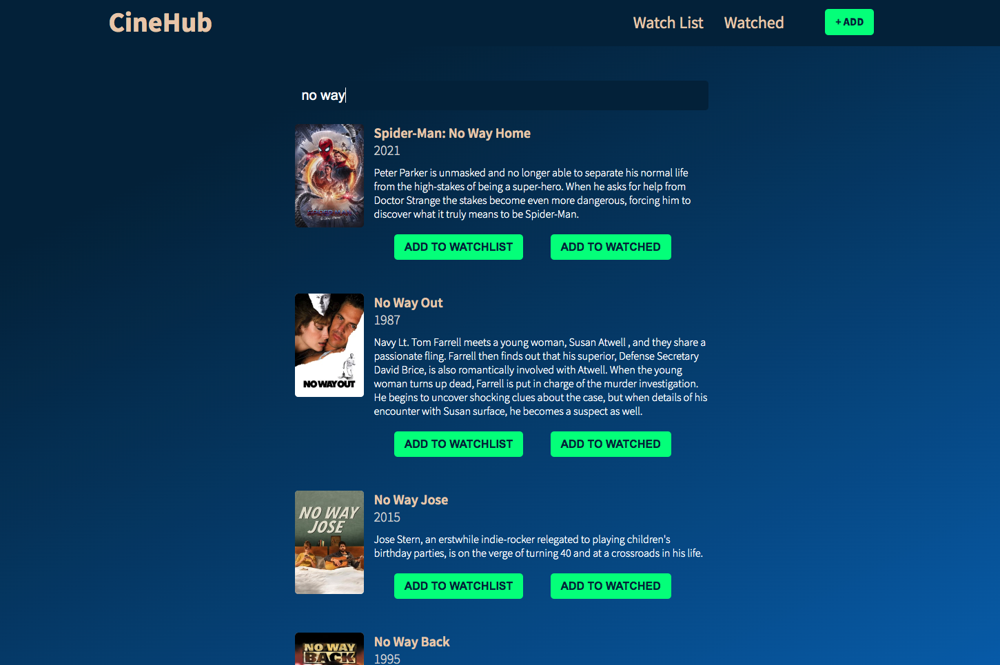
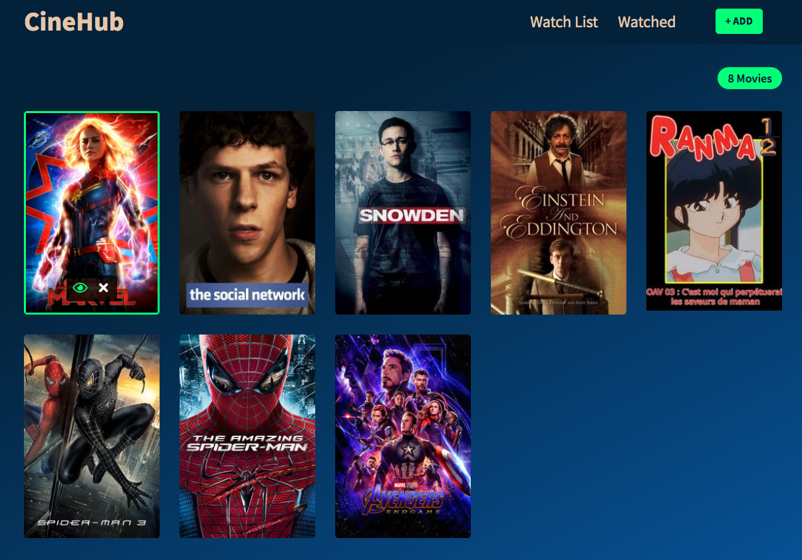

# CineHub
This is a movies **WatchList** web application aiming to make movie lovers' lives easier.  
# Demo-Preview

# Table of contents
- [Project Title](#cinehub)
- [Demo-Preview](#demo-preview)
- [Usage](#usage)
- [Development](#development)
- [Contribute](#contribute)
# Usage
This **Movie WatchList** application allow users to search for their prefered movies from a large collection of all types and styles of movies, and either save them for future watch or move the alreard watched ones to their respective list.

> **_NOTE:_**  Movies can be mover back and forth between the **WatchList** and **Watched** list using the *eye* and *cancel* icons on top of each movie poster.
# Development
- This web application was developed using the best React practices, leveraging some of the latest concepts like the **ContectApi**, **Props**, and **Hooks**.
- The movies are fetched from the [**The Movie Database (TMDB) API**](https://www.themoviedb.org/)
- For the moment, the app uses local storage to persist the data, I look forward to adding authentication, and power the app with a backend API and a SQL/NoSQL Database.

> **_NOTE:_** If you are interested in testing the app on your own, I would suggest to download the repository; from the root directory, run **`npm start`** and open [http://localhost:3000](http://localhost:3000) to view it in your browser.
# Contribute
For any suggestion or feedback, please feel free to reach out to me via [email](mailto:njucesar@gmail.com).
# License
[(Back to top)](#cinehub)

All the code is open source, feel free to integrate it in your projects!

[GNU General Public License version 3](https://opensource.org/licenses/GPL-3.0)
